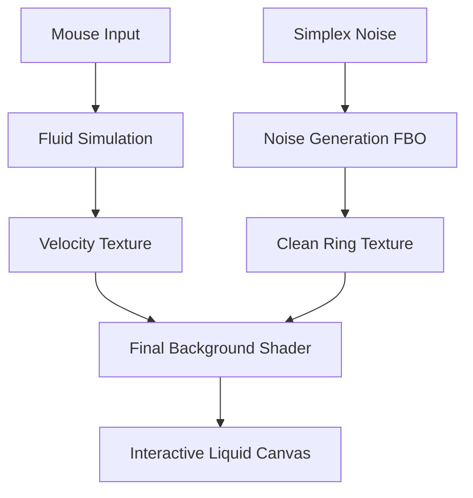

# Build Doc: Liquid Topography (The Blob)

This document explains the multi-pass GPGPU pipeline used to create the interactive "Liquid Topography" effect seen in the hero section.

## Architecture Overview

The system consists of three main stages running every frame:



## 1. Fluid Simulation (`FluidSimulation.tsx`)

A GPGPU solver for **incompressible fluid** (Navier-Stokes equations).

- **Resolution**: 512x512 FBO.
- **Physics**: Solves for Advection, Curl, Vorticity, Divergence, and Pressure.
- **Interaction**: Mouse movement creates "Splats" of velocity in the simulation.
- **Output**: A floating-point texture where the `Red` and `Green` channels represent the `X` and `Y` velocity of the fluid at that point.

## 2. Noise Generation (`SimplexNoiseMaterial.tsx`)

Generates the "Topographic Rings" structure.

- **Algorithm**: Simplex Noise (Procedural).
- **Parameters**: 
  - `uDetail`: Set to **3.0** (Calibrated to site).
  - `uScale`: Controls the size of the organic shapes.
- **Caching**: Rendered to a dedicated `noiseTarget` FBO to ensure high-precision gradients for the final composition.

## 3. Final Composition (`BackgroundMaterial.tsx`)

The "Beauty Pass" that creates the liquid-gel visual.

### Displacement Logic
The fluid's velocity is used to displace the UV coordinates before sampling the noise:
```glsl
vec2 velocity = texture2D(tCursorEffect, uv).xy;
vec2 displacedUV = uv - velocity * uDistortIntensity;
float noise = texture2D(tBackgroundNoise, displacedUV).r;
```

### Topographic SDF Logic
Instead of simple color mapping, we use **Signed Distance Field** logic to render perfectly uniform hairline rings:
1. **Sample Noise**: Sample the noise at the displaced UV.
2. **Calculate Gradient**: Uses forward-differencing to find how fast the noise changes per pixel.
3. **Normalize Distance**: Divide the current noise value by the gradient magnitude to get a distance in **Pixels**.
4. **AA Stroke**: Use `smoothstep` on the pixel distance to render a stroke that is exactly `N` pixels wide, regardless of warp distortion.

## Key Parameters (Sync with landonorris.com)

| Parameter | Value | Description |
| :--- | :--- | :--- |
| `uDetail` | `3.0` | Number of topographic layers. |
| `uDistortIntensity` | `0.5` | Strength of the liquid warp effect. |
| `uStrokeWidth` | `2.0` | Thickness of the ring outlines (in physical pixels). |
| `uCursorIntensity`| `0.15`| Intensity of the "Highlight" color on movement. |

## Dependencies
- `@react-three/fiber`: Main loop and mesh management.
- `@react-three/drei`: Shader material utilities.
- `three`: Core WebGL logic and FBO management.
